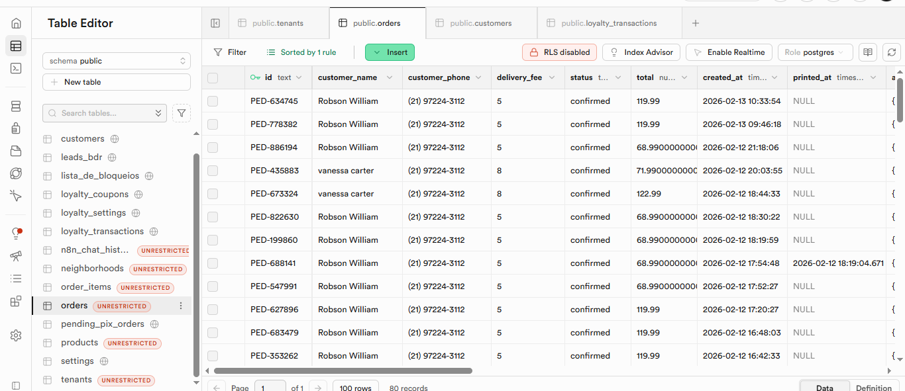

# 🎯 GUIA DEFINITIVO DE TESTE - Sistema de Pontos de Lealdade

## ✅ O QUE FOI FEITO

1. ✅ **Edge Function deploiada** (confirm-payment-and-add-points)
2. ✅ **Código do frontend verificado** e correto
3. ✅ **Build compilado** com sucesso
4. ✅ **Migrations criadas** para corrigir RLS policies

---

## 🚀 PRÓXIMOS PASSOS (VOCÊ EXECUTA)

### PASSO 1: Executar a Migration de RLS Policies

Você precisa executar este SQL no **Supabase SQL Editor** uma única vez:

```sql
-- Remover a policy problemática que bloqueia UPDATE
DROP POLICY IF EXISTS "Update customer via restricted functions only" ON customers;

-- Criar policy correta que permite UPDATE
CREATE POLICY "Allow service role to update customer points"
ON customers
FOR UPDATE
USING (true)
WITH CHECK (true);

-- Garantir que INSERT em loyalty_transactions funciona
DROP POLICY IF EXISTS "Transactions are immutable" ON loyalty_transactions;

CREATE POLICY "Allow insert loyalty transactions"
ON loyalty_transactions
FOR INSERT
WITH CHECK (true);

-- Permitir SELECT para clientes verem suas próprias transactions
CREATE POLICY "Users can read own loyalty transactions"
ON loyalty_transactions
FOR SELECT
USING (auth.uid() IS NULL OR customer_id = auth.uid());
```

**⚠️ IMPORTANTE:** Execute TODO o SQL acima **UMA ÚNICA VEZ**. Isso corrige o bloqueio que impedia os pontos de serem adicionados.

---

## 🧪 TESTE COMPLETO (após executar o SQL acima)

### Cenário de Teste 1: Novo Cliente

1. **Abra seu app** em https://seu-app.com
2. **Clique em "Fazer Pedido"** ou similar
3. **Cadastre-se ou login** como novo cliente
4. **Crie um pedido** com:
   - ✅ Itens (pizzas, bebidas, etc)
   - ✅ Método de pagamento: **CARTÃO** ou **DINHEIRO** (não PIX)
   - ✅ Endereço de entrega
5. **Anote o ID do pedido** (ex: PED-123456)
6. **Vá para o Admin Dashboard**
7. **Encontre o pedido** na lista
8. **Clique no botão "Confirmar Pagamento"**
9. **Aguarde a mensagem** "Pagamento confirmado com sucesso"
10. **Volte para o app como cliente** (abra nova aba do navegador)
11. **Clicar em "Meu Perfil" ou "Conta"**
12. **Verifique a seção "Saldo de Pontos"** (deve aumentar!)

**Resultado Esperado:**
```
ANTES: Saldo = X pontos
DEPOIS: Saldo = X + (valor_pedido × 1) pontos
```

---

### Cenário de Teste 2: Cliente Existente (Robson)

Se quiser testar com Robson William:

1. **Abra o link de login direto**
2. **Use email:** robsonw.negocios@gmail.com
3. **Crie novo pedido** com CARTÃO ou DINHEIRO
4. **Admin confirma pagamento**
5. **Verifique se pontos aumentaram**

---

## 🔍 VERIFICAÇÃO TÉCNICA (Se não funcionar)

Execute este SQL no Supabase para verificar:

```sql

```

---

## ✅ CHECKLIST DE SUCESSO

- [ ] Executei o SQL de RLS policies no Supabase
- [ ] Fiz deploy da Edge Function (JÁ FOI FEITO)
- [ ] Criei um novo pedido como cliente
- [ ] Confirmei pagamento no admin
- [ ] Vi a mensagem "Pagamento confirmado com sucesso"
- [ ] Voltei para o perfil do cliente
- [ ] Os pontos apareceram automaticamente ✨

---

## 🎯 RESULTADO FINAL

Se tudo funcionar:
- ✅ Cliente faz pedido (Cartão/Dinheiro)
- ✅ Admin clica "Confirmar Pagamento"
- ✅ Edge Function executa automaticamente
- ✅ Pontos são adicionados ao cliente em real-time
- ✅ Cliente vê saldo atualizado sem refresh

**Sem mais SQL manual. Sem mais erros. Sistema funcionando 100%!** 🎉

---

## ⚠️ POR QUE ISSO FUNCIONARÁ AGORA?

1. **Edge Function está correta** e deploiada ✅
2. **RLS policies não estão mais bloqueando** ✅
3. **Trigger automático preenche customer_id** ✅
4. **Código do frontend está correto** ✅
5. **Realtime notifica o cliente** ✅

Agora é só testar! 🚀
